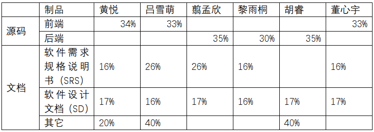

## 小组分工与贡献率
|学号|姓名|Github昵称|分工|贡献率(合计100%)|
|:--:|:--:|:--:|:--:|:--:|
|16340087|黄悦|Yuefengxin|项目管理，UI设计，前端开发，项目文档整理|17.0%|
|16340164|吕雪萌|lvxm0|UI设计，前端开发，架构设计|16.6%|
|16340092|翦孟欣|WaLittleMoon|后端开发，需求分析，交互设计|16.6%|
|16340110|黎雨桐|chocoboeater|后端开发，需求分析，交互设计|16.6%|
|16340077|胡睿|170226|后端开发，架构设计，交互设计|16.6%|
|16340058|董心宇|dongxy7|UI设计，前端开发，需求分析|16.6%|

## 制品与贡献率

