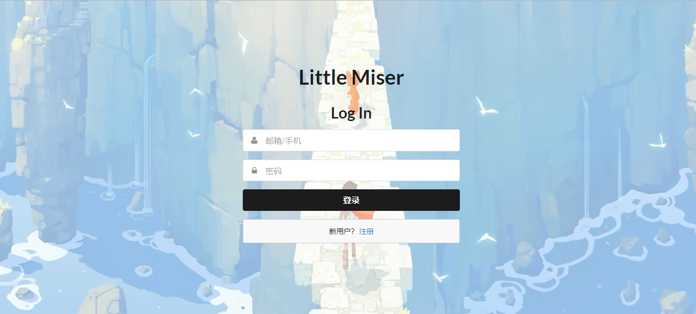
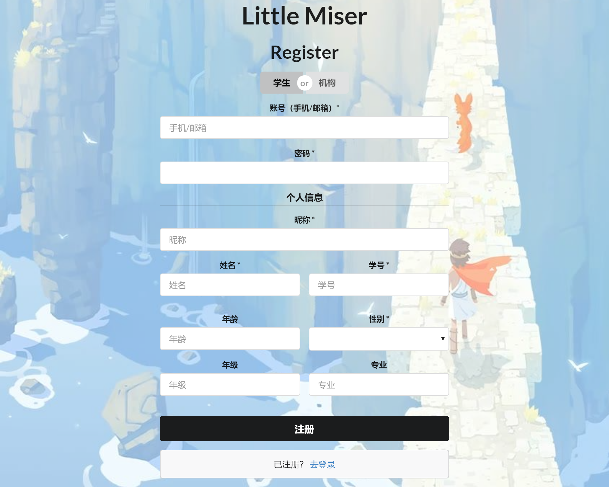
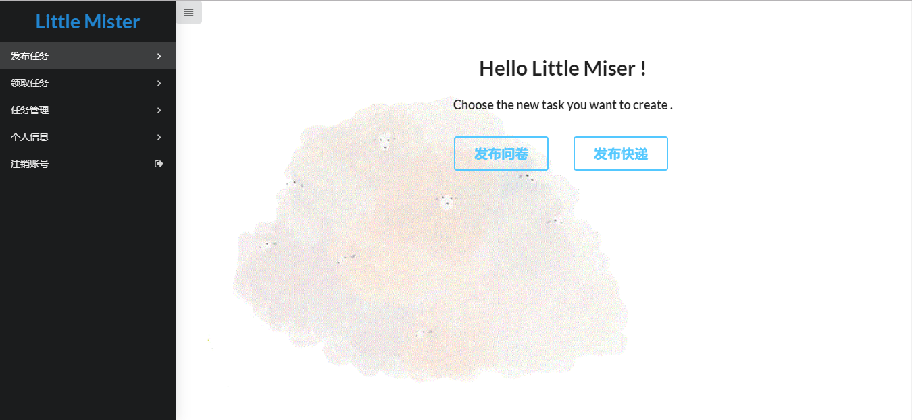
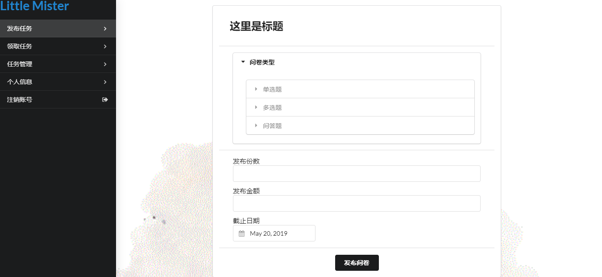
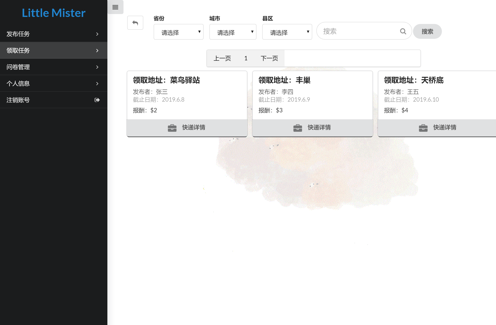
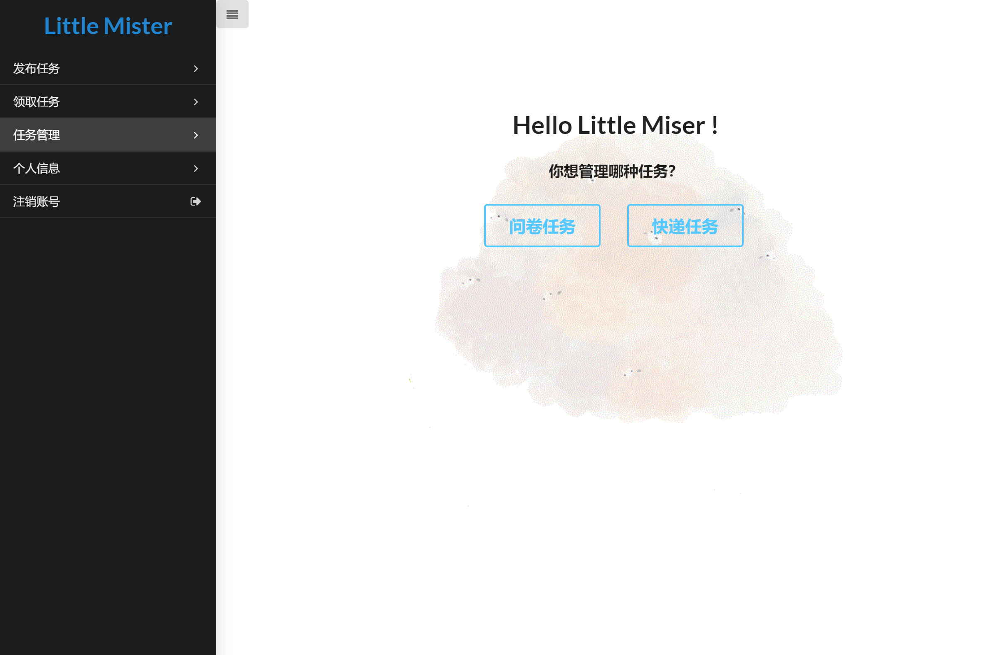
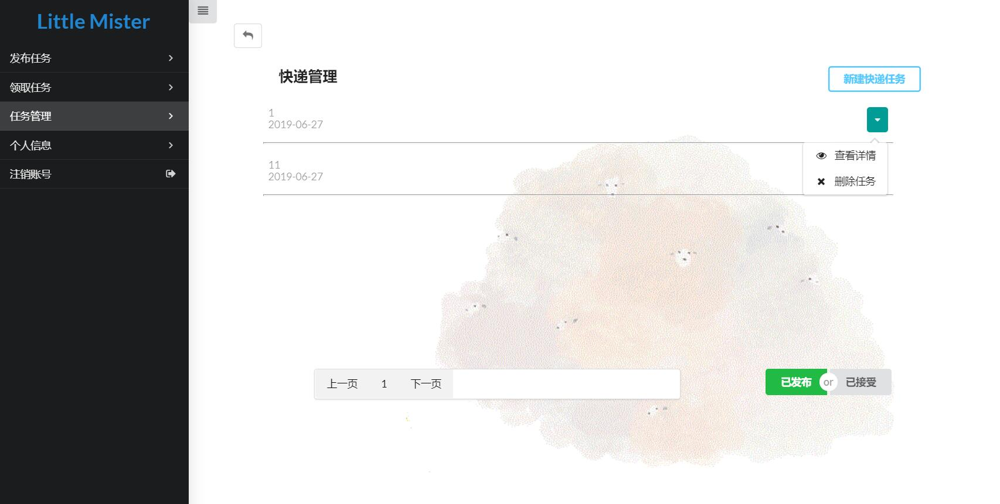
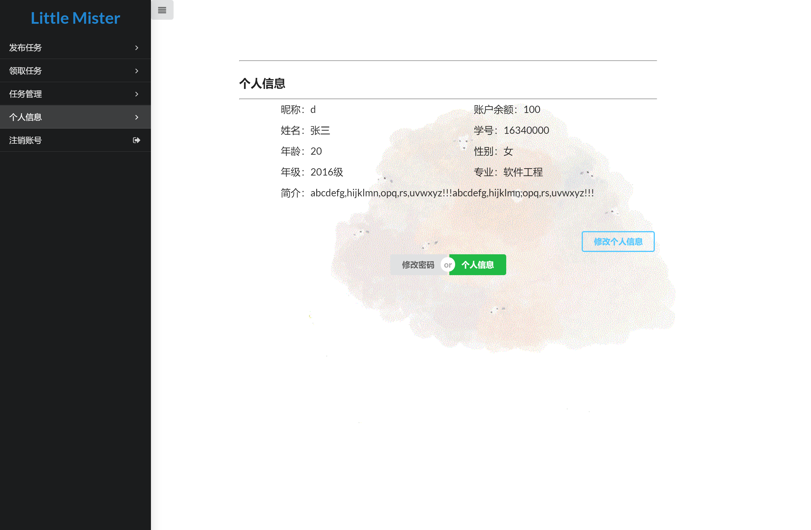

# 用户手册

## LittleMister 系统介绍

**Little Mister** 是以运营为中心的帮助大学生挣闲钱的云服务平台。该平台主要包含两项基本服务：

- “帮你问”是一个专业的在线问卷调查平台，致力于为用户提供功能强大的在线问卷设计、数据采集和调查结果分析等一系列人性化服务。

- ”替你取”旨在为大学生提供小额交易的帮取快递的服务，如某同学在平台上发布任务，出 0.5 元闲钱请同专业同年级取快递。

这两项基本服务均需要任务发布者（称为“奶牛”），提供一定数量的闲钱放入奖金池，学生完成任务可获得系统内部的“闲钱币”，“闲钱币”可用于发布任务或提现。

## 使用原则

- 用户需要先使用 **邮箱/手机** 登录平台。如果第一次进入平台，需要填写信息注册。

  

  

- 进入平台后，通过侧边栏选择功能。默认进入发布任务页面，有两个选择：发布问卷、发布快递

  

- 在发布问卷页面，填写相关信息，点击发布按钮，问卷会在问卷领取列表中显示等待领取。发布问卷会扣除用户填写的金额，用户余额不足则发布失败。

  

- 在发布快递页面，填写相关信息，点击发布按钮，任务会在快递任务领取列表中等待领取。发布问卷会扣除用户填写的报酬金额，用户余额不足则发布失败。

  

- 点击侧边栏 “领取任务” 可以领取问卷任务/快递任务

  

- 侧边栏进入领取问卷任务如下，点击“填写问卷”即可领取任务。搜索栏可以对问卷的名字进行搜索。领取快递页面和领取问卷页面相同。

  

  

- 侧边栏进入任务管理页面，可以管理用户接受、发布的快递/问卷任务

  

- 点击快递任务，可以选择查看详情，删除任务。可以在右下角切换查看已发布和已接受的任务。

  

- 点击问卷任务，可以选择查看统计，删除任务。查看统计页面如下

  

- 在侧边栏进入个人信息页面，可以修改个人信息和密码

  

- 在侧边栏进入注销账号，退出登录，返回登录界面。
