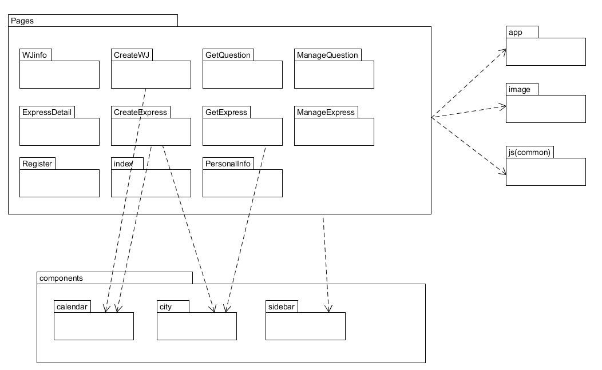

# 软件设计文档 (SD)
## 前端
### 1.技术选型及理由
**Vue** ： 一个类MVVM的渐进式JavaScript前端框架  
**Semantic UI** ：界面清晰简单的CSS工具   
**JQuery** :  一个轻量高效的JavaScript框架  
我们在html文件中使用`<script></script>`导入这些框架，进行前端的界面编写。  

选型理由： 
* Vue框架是当下前端开发中的前沿技术框架，它的核心库只关注视图层，易于上手，它保留了html和css语法，而且我们的组员大都接触过html和css，使用起来比较方便。
* Vue 支持响应式、双向数据绑定等 MVVM 特性，能够很好地支持丰富的用户交互体验。
* Semantic UI 比普通的CSS制作的界面更好看一些，也更容易使用。
* JQuery 可以简洁地操作DOM，并实现异步http请求。它封装JavaScript常用的功能代码，提供一种简便的JavaScript设计模式，优化HTML文档操作、事件处理、动画设计和Ajax交互

### 2.架构设计
使用Vue —— 类MVVM的渐进式JavaScript框架

- 项目目录

  

- 每个文件夹下有三个文件：  

    | 文件     | 作用             |
    | -------- | ---------------- |
    | html   | 页面结构       |
    | css  | 页面样式表  |
    | js | 页面逻辑 |

- 文件夹信息

  - WJinfo：填写问卷页面
  - createExpress ：快递单创建页面
  - createWJ：问卷创建页面
  - expressDestail: 快递单详情页面
  - getExpress： 快递单领取页面
  - getQuestion： 问卷领取页面
  - Page_1 : 首页页面
  - personinfo： 个人信息页面
  - register： 登录注册页面
  - statistics: 问卷统计页面
  
- 系统结构

  ```
    |
   	|
   	├── LittleMiser //前端页面
   	│   ├── WJinfo //问卷填写页面
   	│   │   ├── WJinfo.html //问卷填写页面结构文件
   	│   │   ├── WJinfo.css //问卷填写页面样式文件
   	│   │   └── WJinfo.js  //问卷填写页面逻辑文件
   	|   |
   	│  	├── createExpress //快递单创建页面
   	│   │   ├── createExpress.html //快递单创建结构文件
   	│   │   ├── createExpress.css //快递单创建样式文件
   	│   │   └── createExpress.js  //快递单创建逻辑文件
   	|   |
   	│  	├── createWJ //问卷创建页面
   	│   │   ├── createWJ.html //问卷创建结构文件
   	│   │   ├── createWJ.css //问卷创建样式文件
   	│   │   └── createWJ.js  //问卷创建逻辑文件
   	|   |
   	│  	├── ExpressDetail //快递单详情页面
   	│   │   ├── ExpressDetail.html //快递单详情结构文件
   	│   │   ├── ExpressDetail.css //快递单详情样式文件
   	│   │   └── ExpressDetail.js  //快递单详情逻辑文件
   	|   |
   	│  	├── getExpress //快递单获取任务页面
   	│   │   ├── getExpress.html //快递单获取任务结构文件
   	│   │   ├── getExpress.css //快递单获取任务样式文件
   	│   │   └── getExpress.js  //快递单获取任务逻辑文件
   	│	│
   	│ 	├── getQuestion //问卷获取任务页面
   	│   │   ├── getQuestion.html //问卷获取任务结构文件
   	│   │   ├── getQuestion.css //问卷获取任务样式文件
   	│   │   └── getQuestion.js  //问卷获取任务逻辑文件
   	│	│
   	│  	├── manageExpress //快递单管理页面
   	│   │   ├── manageExpress.html //快递单管理结构文件
   	│   │   ├── manageExpress.css //快递单管理样式文件
   	│   │   └── manageExpress.js  //快递单管理逻辑文件
   	│	│
   	│ 	├── manageQuestion //问卷管理页面
   	│   │   ├── manageQuestion.html //问卷管理结构文件
   	│   │   ├── manageQuestion.css //问卷管理样式文件
   	│   │   └── manageQuestion.js  //问卷管理逻辑文件
   	│	│
   	│ 	├── page_1//首页页面
   	│   │   ├── page_1.html //首页结构文件
   	│   │   ├── page_1.css //首页样式文件
   	│   │   └── page_1.js  //首页逻辑文件
   	│	│
      │ 	├── personinfo //个人信息页面
   	│   │   ├── personinfo.html //个人信息结构文件
   	│   │   ├── personinfo.css //个人信息样式文件
   	│   │   └── personinfo.js  //个人信息逻辑文件
   	│	│
   	│ 	├── register //登录注册页面
   	│   │   ├── register.html //登录注册结构文件
   	│   │   ├── register.css //登录注册样式文件
   	│   │   └── register.js  //登录注册逻辑文件
   	│	│
   	│ 	├── statistics //问卷统计页面
   	│   │   ├── statistics.html //问卷统计结构文件
   	│   │   ├── statistics.css //问卷统计样式文件
   	│   │   └── statistics.js  //问卷统计逻辑文件
    	│	│
   	│ 	├── index //登录页面
   	│   │   ├── index.html //登录结构文件
   	│   │   ├── index.css //登录样式文件
   	│   │   └── index.js  //登录逻辑文件
   	│	│
  	│ 	├── image // 使用的背景图
   	│	│
   	└── .DS_Store
  ```

### 3.模块划分

根据业务逻辑功能与UI设计，将“小小财迷”（挣闲钱系统）前端主要概分为任务系统与账户管理系统。分为五个页面，其中又具体根据问卷和快递任务的不同细分两个子模块。每个页面中包含html文件，css文件以及js文件，分别处理页面布局，具体样式，以及逻辑事件的处理。


模块划分大致如下：
- 任务管理系统：
	- CreateTask：发布任务（快递/问卷）
		- 发布问卷
		- 发布快递
	- GetTask：领取任务（快递/问卷）
		- 领取问卷任务
			- 填写问卷
		- 领取快递任务
			- 快递详情页
	- ManageTask：管理任务（快递/问卷）
		- 管理问卷
			- 问卷结果回收，查看统计
		- 管理快递
			- 详情页面
- 账户管理系统：
	- Login/Register：组织或个人注册/登录
		- 注册页面
		- 登录页面
	- 个人信息管理
		- 密码变更
		- 信息更改
		- 资金管理（收入支出）
		
		
依据功能划分模块及页面，并完成后续的具体实现编码。
- 用到部分开源库和组件，例如日历组件，地理位置的省市区组件等。还有自定义相关组件，如显示任务内容的卡片等。
- 另外包括全局文件，配置文件等。
- 相关资源引用，如图片等。
- 公共引用部分，例如使用开源的Semantic时需要的相关js文件。

 
### 4.软件设计技术
**MVVM**  
MVVM是Model-View-ViewModel的简写。即模型-视图-视图模型。【模型】指的是后端传递的数据。【视图】指的是所看到的页面。【视图模型】mvvm模式的核心，它是连接view和model的桥梁。它有两个方向：一是将【模型】转化成【视图】，即将后端传递的数据转化成所看到的页面。实现的方式是：数据绑定。二是将【视图】转化成【模型】，即将所看到的页面转化成后端的数据。实现的方式是：DOM 事件监听。这两个方向都实现的，我们称之为数据的双向绑定。  
  
Vue就是基于MVVM模式实现的一套框架，在vue中：Model:指的是js中的数据，如对象，数组等等。View:指的是页面视图。viewModel:指的是vue实例化对象。
我们所编写的每一个界面都有MVVM的体现，比如，对于登录界面
View  
  
Model  

ViewModel  
    

**Object Oriented Programming**    
面向对象程序设计(Object Oriented Programming)作为一种新方法，其本质是以建立模型体现出来的抽象思维过程和面向对象的方法。  
面向对象的基本思想是使用类, 对象, 继承, 封装, 消息等基本概念进行程序设计。 
面向对象方法的三个基本特征:
* 封装性：将对象的实现细节隐藏起来, 通过一些公共的接口方法来供外部调用对象的功能
* 继承性：是面向对象实现的的重要手段,子类继承父类, 子类直接获得父类的非private属性和方法
* 多态性: 子类对象可以赋值给父类对象引用, 但运行的时候仍然表现出子类的行为特征,同一个类型的对象在执行同一个方法时, 可能表现出不同的特征  

在我们的项目中，每一个界面都是单独封装的对象，写在一个单独的文件夹中
  

每一个界面中，按钮等控件也被作为一个对象，在html绑定js的点击事件
  
  


## 后端
### 1.技术选型及理由
项目后端采用的技术栈为 **nodejs+Express+MongoDB**
- **nodejs+express**
  - Express 作为一个简洁而灵活的 node.js Web应用框架, 提供了一系列强大特性和丰富的 HTTP 工具来帮助创建各种 Web 应用。
  - Express 框架核心特性：
    - 可以设置中间件来响应 HTTP 请求。
    - 定义了路由表用于执行不同的 HTTP 请求动作。
    - 可以通过向模板传递参数来动态渲染 HTML 页面。
  - 简单易实现
- **MongoDB**
  - MongoDB 是一种文档导向数据库管理系统，为 WEB 应用提供了可扩展的高性能数据存储解决方案。
  - MongoDB 功能丰富，可以使用 update() 命令实现替换完成的文档（数据）或者一些指定的数据字段 。
  - 结合 nodejs 操作起来比较简单和容易。
  - 网上可供参考资源文档较多。

### 4. 所用的软件设计技术
- **面向对象编程**  
  项目使用了面向对象编程的封装思想，按照业务逻辑将代码的数据表模块和API模块分别进行了封装。  
  ```
  └──Backend：服务端开发的源码
      ├─models
      |    ├─db.js
      │    ├─express.js
      │    ├─paper.js
      |    ├─user.js
      ├─routers
      |    ├─createPaper.js
      │    ├─expr.js
      │    ├─fillPaper.js
      |    ├─getPaperInfo.js
      |    ├─managePaper.js
      │    ├─user.js
  ```
  以快递数据表为例：
  ```
  var mongoose = require('./db'),
    Schema = mongoose.Schema;

  var ExpressSchema = new Schema({
      user: String,
      contact : String,
      phone : String,
      payment : Number,
      due_date : Date,
      location : String,
      pickup_address : String,
      delivery_address : String,
      description : String,
      isRecepted: Boolean,
      isFinished: Boolean,
      recept_user: String
  })

  module.exports = mongoose.model('Express', ExpressSchema);  
  ```